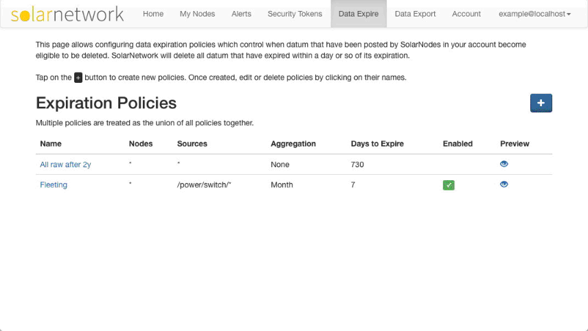

# SolarUser Data Expiration Framework

This project provides a framework for allowing users to define data expiration
policies so that SolarNetwork can delete expired data according to those policies.

# Expiration Policy

An expiration policy defines **which** data expires and **when**. Expiration
policies allow configuring the following items:

| Setting     | Description |
|-------------|-------------|
| Node IDs    | A list of node IDs to delete posted data for, or all nodes if not configured. |
| Source IDs  | A list of source IDs to delete posted data for, or all sources if not configured. Ant-style path patterns are allowed, like `/power/**` to match anything starting with `/power/`. |
| Aggregation | SolarNetwork automatically stores rolled-up datum for hourly, daily, and monthly aggregate levels. By default these records are **not** deleted. Configuring an aggregate level in a policy means that matching records for that level, and any level lower than it, will also be deleted. |
| Age         | The age after which data expires. The age is calculated from the timestamp defined in the datum themselves, not the time they are posted to SolarNetwork. |
| Enabled     | Policies can be toggled on and off, which can be used to preview the impact a policy would have before it is activated. |

# Policy Execution

SolarNetwork will apply expiration policies on its own schedule, so expired
data might persist for a short time.
