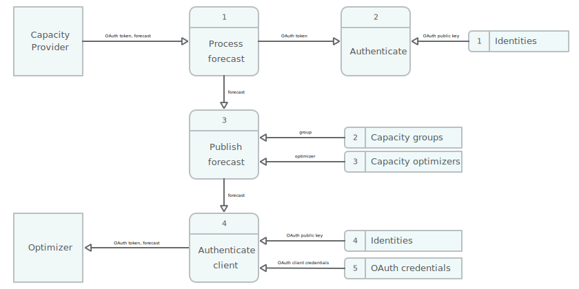

# SolarOSCP Flexibility Provider

This app provides web APIs for the [Open Smart Charging Protocol (OSCP)][oscp] Flexibility Provider
system, for integration with Capacity Provider and Capacity Optimizer systems. The SolarNet
Flexibility Provider system delegates all load management functions to the Capacity Optimizer
system: as capacity forecast messages are received from integrated Capacity Provider systems, they
are forwarded to an associated Capacity Optimizer system and it is the responsibility of the
optimizer to decide how to manage the load of any associated energy assets.

In the context of SolarNetwork, it is assumed that SolarNode devices provide control integration to
energy assets, and the SolarNetwork API can be used by the Capacity Optimizer to execute any needed
load management actions in response to the Capacity Provider forecast messages. To report the asset
and capacity group measurements to the Capacity Optimizer and Capacity Provider systems, appropriate
datum streams from SolarNode devices are associated with capacity groups, and this system will query
those streams for the measurement values.

# OAuth support

In addition to the OSCP-defined token authentication scheme used for authentication between this
system and Capacity Provider/Optimizer systems, OAuth 2 access tokens are supported, using the
_client credentials_ authentication flow.

TODO: document fully

# Update group capacity forecast (CP →  FP)

Here is a data flow diagram representing the OSCP _update group capacity forecast_ function,
initiated by a Capacity Provider and using OAuth for authentication:




# Dependencies

This app depends on the following projects:

 * [solarnet-common][solarnet-common]
 * [solarnet-datum][solarnet-datum]
 * [solarnet-instructor][solarnet-instructor]
 * [solarnet-oscp][solarnet-oscp]


# Runtime Profiles

The following Spring runtime profiles are available:

| Profile | Description |
|:--------|:------------|
| `aws-secrets`  | Enables AWS Secrets Manager persistence for OAuth credentials. If not active then a simple file-based resource will be used. |
| `http-trace`   | Enables HTTP wire-level logging for the `net.solarnetwork.http.REQ` and `net.solarnetwork.http.RES` loggers. |
| `mqtt`         | Enables integration with SolarFlux/MQTT. See [SolarFluxPublishingConfig][SolarFluxPublishingConfig]. |
| `no-solarflux` | Disable SolarFlux MQTT integration when `mqtt` profile is active. |
| `oscp-jobs`    | Enable OSCP periodic jobs to support things like heartbeats and measurement reporting. See [JobConfig][JobConfig]. |
| `oscp-v20`     | Enable OSCP v2.0 support. |

For example, in a production deployment the `SPRING_PROFILES_ACTIVE` environment variable can be
configured as

```
SPRING_PROFILES_ACTIVE="production,mqtt,oscp-v20,oscp-jobs"
```


# Runtime configuration

See the [application.yml][app-config] file for the available runtime configuration properties, and
their default values. You can override any property by creating an `application.yml` file in the
working directory of the application, or via profile-specific files like
`application-production.yml` when the `production` profile is active.


# Building

The build is managed by Gradle, and requires a Java Development Kit version 21+ to build (and run).

```sh
# Unix-like OS:
../gradlew build

# Build without running tests:
../gradlew build -x test

# Windows:
../gradlew.bat build
```

The build produces an executable JAR at `build/libs/solaroscp-fp-x.y.z.jar`.


[app-config]: src/main/resources/application.yml
[oscp]: https://www.openchargealliance.org/protocols/oscp-20/
[solarnet-common]: ../common/
[solarnet-datum]: ../datum/
[solarnet-instructor]: ../instructor/
[solarnet-oscp]: ../oscp/
[JobConfig]: src/main/java/net/solarnetwork/central/oscp/fp/config/JobConfig.java
[SolarFluxPublishingConfig]: src/main/java/net/solarnetwork/central/oscp/fp/config/SolarFluxPublishingConfig.java
